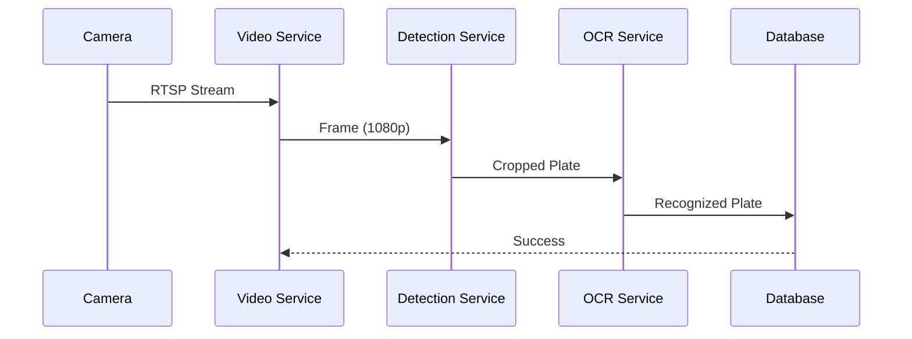

# **ДЕТАЛЬНЫЙ ПЛАН ДОРАБОТОК ПРОЕКТА ANPR**

## **Версия плана: 2.0**
**Дата составления:** 2024
**Целевая версия:** Production Ready 3.0
**Ожидаемый срок:** 8 недель (2 месяца)

---

## **ИСПРАВЛЕНИЕ КРИТИЧЕСКИХ ПРОБЛЕМ (НЕДЕЛЯ 1)**

### **День 1-2: Квантование CRNN (Высокий приоритет)**

**Проблема:** Неправильный порядок квантования PyTorch FX

**Задачи:**
1. Создать скрипт предобработки модели
2. Настроить корректный пайплайн квантования
3. Добавить калибровочный датасет

**Файлы для изменения:**
```bash
/scripts/quantize_crnn.py                    # Новый скрипт
/anpr/recognition/calibration_dataset.py     # Новый модуль
/anpr/recognition/crnn_recognizer.py         # Рефакторинг
/models/ocr_crnn/calibration/                # Новая директория
```

**Код решения:**
```python
# Правильный пайплайн квантования:
# 1. Загрузить предобученную модель
model = CRNN(num_classes)
model.load_state_dict(torch.load(weights_path))

# 2. Подготовить к квантованию
model_prepared = quantize_fx.prepare_fx(model, qconfig, example_inputs)

# 3. Калибровка (обязательный шаг!)
for calib_batch in calibration_data:
    model_prepared(calib_batch)

# 4. Конвертировать
model_quantized = quantize_fx.convert_fx(model_prepared)

# 5. Сохранить квантованную версию
torch.jit.save(torch.jit.script(model_quantized), "quantized_model.pt")
```

**Метрики успеха:**
- Скорость инференса: +30%
- Память: -50%
- Точность: потери < 2%

---

### **День 3: CTC Декодер (Высокий приоритет)**

**Проблема:** Простой argmax вместо CTC beam search

**Задачи:**
1. Реализовать CTC beam search
2. Добавить поддержку словаря языка
3. Оптимизировать для production

**Файлы:**
```bash
/anpr/recognition/ctc_decoder.py             # Новый модуль
/anpr/recognition/crnn_recognizer.py         # Интеграция
/config/ocr_alphabet.json                    # Конфигурация
```

**Код решения:**
```python
class CTCBeamDecoder:
    def __init__(self, alphabet: str, beam_width: int = 10):
        self.alphabet = [''] + list(alphabet)  # blank первый
        self.beam_width = beam_width
        
    def decode(self, log_probs: torch.Tensor) -> List[Tuple[str, float]]:
        """CTC beam search с pruning"""
        # Реализация алгоритма Graves (2006)
        
    def decode_with_lm(self, log_probs: torch.Tensor, language_model) -> str:
        """Интеграция с языковой моделью"""
```

**Метрики успеха:**
- Точность OCR: +5-10%
- CER (Character Error Rate): < 5%
- Задержка: < 10мс на номер

---

### **День 4-5: Валидация номеров (Средний приоритет)**

**Проблема:** Отсутствие постобработки и валидации

**Задачи:**
1. Реализовать валидатор для РФ/СНГ форматов
2. Добавить коррекцию частых ошибок OCR
3. Создать систему плагинов для новых форматов

**Файлы:**
```bash
/anpr/recognition/plate_validator.py         # Новый модуль
/anpr/recognition/text_corrector.py          # Новый модуль
/config/plate_formats/                       # Новая директория
   - russia.yaml
   - ukraine.yaml
   - kazakhstan.yaml
```

**Код решения:**
```python
class PlateValidator:
    FORMATS = {
        'RU': [
            r'^[АВЕКМНОРСТУХ]\d{3}[АВЕКМНОРСТУХ]{2}\d{2,3}$',
            r'^[АВЕКМНОРСТУХ]{2}\d{6}$',  # Транзит
            r'^\d{4}[АВЕКМНОРСТУХ]{2}\d{2,3}$',  # Прицепы
        ]
    }
    
    CORRECTIONS = {
        '0': 'О', '1': 'Т', '8': 'В', '4': 'Ч',
        'A': 'А', 'B': 'В', 'C': 'С', 'E': 'Е',
        'H': 'Н', 'K': 'К', 'M': 'М', 'O': 'О',
        'P': 'Р', 'T': 'Т', 'X': 'Х', 'Y': 'У'
    }
```

**Метрики успеха:**
- Валидация: >95% корректных номеров
- Автокоррекция: исправление 70% ошибок
- Поддержка: 10+ стран

---

## **РЕФАКТОРИНГ АРХИТЕКТУРЫ (НЕДЕЛИ 2-3)**

### **Неделя 2: Внедрение интерфейсов и DI**

**Цель:** Сделать код тестируемым и расширяемым

**Задачи:**
1. Определить ключевые интерфейсы
2. Реализовать контейнер зависимостей
3. Рефакторинг ChannelWorker

**Новая структура:**
```
/anpr/core/interfaces/
   - idetector.py      # Интерфейс детектора
   - irecognizer.py    # Интерфейс распознавателя
   - istorage.py       # Интерфейс хранилища
   - itracker.py       # Интерфейс трекера

/anpr/core/di/
   - container.py      # DI контейнер
   - providers.py      # Провайдеры зависимостей
   - decorators.py     # Декораторы для инъекции
```

**Код интерфейсов:**
```python
# Пример интерфейса детектора
class IDetector(Protocol):
    @abstractmethod
    def detect(self, frame: np.ndarray) -> List[Detection]:
        """Базовый метод детекции"""
        
    @abstractmethod
    def track(self, frame: np.ndarray) -> List[TrackedDetection]:
        """Метод трекинга"""
        
    @property
    @abstractmethod
    def is_gpu_available(self) -> bool:
        """Доступность GPU"""
```

**DI контейнер:**
```python
class Container:
    def __init__(self):
        self._services = {}
        
    def register_singleton(self, interface, implementation):
        """Регистрация синглтона"""
        
    def resolve(self, interface):
        """Разрешение зависимости"""
        
# Использование
container = Container()
container.register_singleton(IDetector, YOLODetector)
container.register_singleton(IRecognizer, CRNNRecognizer)

detector = container.resolve(IDetector)
```

---

### **Неделя 3: Разделение ChannelWorker**

**Цель:** Убрать нарушение Single Responsibility Principle

**Текущие проблемы:**
- ChannelWorker делает всё: захват, обработка, сохранение, UI
- Сложно тестировать
- Невозможно переиспользовать компоненты

**Новая архитектура:**
```python
# Старый подход (плохо)
class ChannelWorker(QtCore.QThread):
    def run(self):
        # 500+ строк, смешение ответственностей
        
# Новый подход (хорошо)
class ChannelCoordinator:
    def __init__(self, 
                 stream_service: IStreamService,
                 detection_service: IDetectionService,
                 event_service: IEventService):
        self.stream = stream_service
        self.detection = detection_service
        self.events = event_service
        
    async def process_channel(self):
        # Оркестрация без деталей реализации
```

**Новые сервисы:**
1. **VideoStreamService** - работа с видеопотоками
2. **DetectionPipelineService** - пайплайн детекции
3. **EventProcessingService** - обработка событий
4. **StorageService** - работа с хранилищами
5. **UINotificationService** - уведомления UI

---

## **ОПТИМИЗАЦИЯ ПРОИЗВОДИТЕЛЬНОСТИ (НЕДЕЛЯ 4)**

### **День 1-2: Управление памятью**

**Проблема:** Утечки памяти, копирование буферов

**Оптимизации:**
1. Пул буферов для кадров
2. Zero-copy передача между потоками
3. Кэширование результатов

**Код пула буферов:**
```python
class ImageBufferPool:
    """Пул переиспользуемых буферов"""
    
    def __init__(self, width: int, height: int, channels: int = 3, pool_size: int = 10):
        self.buffers = [
            np.zeros((height, width, channels), dtype=np.uint8)
            for _ in range(pool_size)
        ]
        self.lock = threading.Lock()
        
    def acquire(self) -> np.ndarray:
        """Получить свободный буфер"""
        with self.lock:
            if self.buffers:
                return self.buffers.pop()
            # Если нет свободных, создать новый
            return np.zeros((self.height, self.width, self.channels), dtype=np.uint8)
            
    def release(self, buffer: np.ndarray):
        """Вернуть буфер в пул"""
        with self.lock:
            if len(self.buffers) < self.max_pool_size:
                self.buffers.append(buffer)
```

**Оптимизация QImage:**
```python
class SharedImageBuffer:
    """Shared memory для Qt изображений"""
    
    def __init__(self, width: int, height: int):
        self.shared_memory = QSharedMemory("anpr_buffer")
        self.size = width * height * 3  # RGB
        
    def to_qimage(self, frame: np.ndarray) -> QImage:
        """Конвертация без копирования"""
        if not self.shared_memory.create(self.size):
            # Использовать существующий
            self.shared_memory.attach()
            
        self.shared_memory.lock()
        try:
            # Прямая запись в shared memory
            buffer = self.shared_memory.data()
            buffer.setsize(self.size)
            frame.tobytes(buffer)
        finally:
            self.shared_memory.unlock()
            
        return QImage(buffer, self.width, self.height, QImage.Format_RGB888)
```

---

### **День 3-4: Батч-обработка**

**Проблема:** Последовательная обработка каждого номера

**Решение:** Batch inference для CRNN

**Код батч-обработчика:**
```python
class BatchOCRProcessor:
    """Асинхронный батч-процессор"""
    
    def __init__(self, recognizer: IRecognizer, batch_size: int = 8, max_wait_ms: int = 100):
        self.recognizer = recognizer
        self.batch_size = batch_size
        self.max_wait = max_wait_ms
        self.queue = asyncio.Queue()
        self.results = {}
        self._processor_task = asyncio.create_task(self._process_batches())
        
    async def recognize(self, plate_image: np.ndarray) -> Tuple[str, float]:
        """Добавить в очередь и ждать результат"""
        future = asyncio.Future()
        item_id = uuid.uuid4().hex
        
        await self.queue.put({
            'id': item_id,
            'image': plate_image,
            'future': future
        })
        
        return await future
    
    async def _process_batches(self):
        """Фоновый обработчик батчей"""
        while True:
            batch = []
            start_time = time.time()
            
            # Собрать батч
            while len(batch) < self.batch_size:
                try:
                    # Ждать следующий элемент с таймаутом
                    item = await asyncio.wait_for(
                        self.queue.get(),
                        timeout=(self.max_wait / 1000)
                    )
                    batch.append(item)
                except asyncio.TimeoutError:
                    # Таймаут - обработать накопленный батч
                    if batch:
                        break
                        
            if not batch:
                continue
                
            # Подготовить батч для модели
            images = [item['image'] for item in batch]
            batch_results = await self.recognizer.recognize_batch(images)
            
            # Раздать результаты
            for item, result in zip(batch, batch_results):
                item['future'].set_result(result)
```

---

### **День 5: Мониторинг и метрики**

**Проблема:** Нет инструментов мониторинга производительности

**Решение:** Система метрик и алертинга

**Код метрик:**
```python
class PerformanceMetrics:
    """Сбор и агрегация метрик"""
    
    METRICS = {
        'detection_latency': Histogram('ms', buckets=[1, 5, 10, 25, 50, 100]),
        'recognition_latency': Histogram('ms', buckets=[1, 5, 10, 25, 50, 100]),
        'fps': Gauge('frames_per_second'),
        'memory_usage': Gauge('mb'),
        'queue_size': Gauge('items'),
        'accuracy': Gauge('percent'),
    }
    
    def record_detection_time(self, channel: str, time_ms: float):
        self.METRICS['detection_latency'].observe(time_ms, labels={'channel': channel})
        
    def export_prometheus(self) -> str:
        """Экспорт в формате Prometheus"""
        output = []
        for name, metric in self.METRICS.items():
            output.append(f"# TYPE anpr_{name} {metric.type}")
            output.append(metric.format())
        return '\n'.join(output)

class HealthCheck:
    """Проверка здоровья системы"""
    
    CHECKS = [
        ('model_loaded', self._check_models),
        ('database_connection', self._check_database),
        ('disk_space', self._check_disk),
        ('gpu_available', self._check_gpu),
    ]
    
    async def run_checks(self) -> Dict[str, HealthStatus]:
        """Запуск всех проверок"""
        results = {}
        for name, check in self.CHECKS:
            try:
                results[name] = await check()
            except Exception as e:
                results[name] = HealthStatus.ERROR(str(e))
        return results
```

---

## **РАСШИРЕНИЕ ФУНКЦИОНАЛЬНОСТИ (НЕДЕЛИ 5-6)**

### **Неделя 5: Международная поддержка**

**Задачи:**
1. Конфигурируемые форматы номеров
2. Автоопределение страны
3. Мультиязычный OCR

**Структура конфигурации:**
```yaml
# config/countries/russia.yaml
name: "Российская Федерация"
code: "RU"
license_plate_formats:
  - regex: "^[АВЕКМНОРСТУХ]\\d{3}[АВЕКМНОРСТУХ]{2}\\d{2,3}$"
    description: "Стандартный номер"
    example: "А123БВ77"
    
  - regex: "^[АВЕКМНОРСТУХ]{2}\\d{6}$"
    description: "Транзитный номер"
    example: "АА123456"
    
  - regex: "^\\d{4}[АВЕКМНОРСТУХ]{2}\\d{2,3}$"
    description: "Номер прицепа"
    example: "1234АВ77"

ocr_alphabet: "0123456789ABCEHKMOPTXYАВЕКМНОРСТУХ"
region_codes:
  - "77": "Москва"
  - "78": "Санкт-Петербург"
  - "01": "Адыгея"
```

**Код детектора страны:**
```python
class CountryDetector:
    """Автоопределение страны номера"""
    
    def detect(self, plate_text: str) -> Optional[CountryInfo]:
        for country in self.countries:
            for pattern in country.license_plate_formats:
                if re.match(pattern.regex, plate_text):
                    return country
        return None
        
    def suggest_correction(self, plate_text: str) -> List[Correction]:
        """Предложить коррекцию для невалидных номеров"""
```

---

### **Неделя 6: Web API и удалённое управление**

**Задачи:**
1. REST API на FastAPI
2. WebSocket для реального времени
3. Аутентификация и авторизация

**Структура API:**
```python
# api/main.py
app = FastAPI(
    title="ANPR API",
    version="3.0.0",
    description="API для системы распознавания номеров"
)

# API endpoints
@app.get("/api/v1/channels")
async def list_channels():
    """Получить список каналов"""
    
@app.post("/api/v1/channels/{channel_id}/control")
async def control_channel(channel_id: str, action: ChannelAction):
    """Управление каналом"""
    
@app.get("/api/v1/events")
async def search_events(
    plate: Optional[str] = None,
    channel: Optional[str] = None,
    start_date: Optional[datetime] = None,
    end_date: Optional[datetime] = None,
    limit: int = 100
):
    """Поиск событий"""
    
@app.websocket("/ws/events")
async def websocket_events(websocket: WebSocket):
    """WebSocket для событий в реальном времени"""
    await websocket.accept()
    while True:
        # Отправка новых событий
        event = await event_queue.get()
        await websocket.send_json(event.dict())
```

**Аутентификация:**
```python
# api/auth.py
oauth2_scheme = OAuth2PasswordBearer(tokenUrl="/api/auth/token")

async def get_current_user(token: str = Depends(oauth2_scheme)):
    """Валидация JWT токена"""
    try:
        payload = jwt.decode(token, SECRET_KEY, algorithms=[ALGORITHM])
        user_id = payload.get("sub")
        if user_id is None:
            raise HTTPException(status_code=401, detail="Invalid token")
    except JWTError:
        raise HTTPException(status_code=401, detail="Invalid token")
        
    user = await get_user(user_id)
    if user is None:
        raise HTTPException(status_code=401, detail="User not found")
    return user

@app.post("/api/auth/token")
async def login(form_data: OAuth2PasswordRequestForm = Depends()):
    """Получение JWT токена"""
    user = authenticate_user(form_data.username, form_data.password)
    if not user:
        raise HTTPException(status_code=401, detail="Invalid credentials")
        
    access_token = create_access_token(data={"sub": user.username})
    return {"access_token": access_token, "token_type": "bearer"}
```

---

## **ТЕСТИРОВАНИЕ И КАЧЕСТВО (НЕДЕЛЯ 7)**

### **День 1-2: Unit-тесты**

**Цель:** Покрытие >80% критического кода

**Структура тестов:**
```
/tests/
├── unit/
│   ├── test_detectors/
│   │   ├── test_yolo_detector.py
│   │   └── test_motion_detector.py
│   ├── test_recognition/
│   │   ├── test_crnn_recognizer.py
│   │   ├── test_ctc_decoder.py
│   │   └── test_plate_validator.py
│   ├── test_services/
│   │   ├── test_video_stream.py
│   │   └── test_event_processor.py
│   └── test_core/
│       ├── test_di_container.py
│       └── test_metrics.py
├── integration/
│   ├── test_pipeline.py
│   └── test_api.py
├── fixtures/
│   ├── test_videos/
│   ├── test_images/
│   └── test_models/
├── conftest.py
└── pytest.ini
```

**Пример теста:**
```python
# tests/unit/test_yolo_detector.py
class TestYOLODetector:
    @pytest.fixture
    def detector(self):
        return YOLODetector("tests/fixtures/test_models/yolo_test.pt", "cpu")
        
    def test_detection(self, detector, sample_frame):
        """Тест базовой детекции"""
        detections = detector.detect(sample_frame)
        
        assert len(detections) > 0
        for det in detections:
            assert 'bbox' in det
            assert 'confidence' in det
            assert 0 <= det['confidence'] <= 1
            
    def test_tracking(self, detector, sample_frames):
        """Тест трекинга между кадрами"""
        results = []
        for frame in sample_frames:
            detections = detector.track(frame)
            results.append(detections)
            
        # Проверить, что track_id сохраняется между кадрами
        track_ids = {d['track_id'] for frame_dets in results for d in frame_dets}
        assert len(track_ids) > 0
        
    @pytest.mark.parametrize("device", ["cpu", "cuda"])
    def test_device_selection(self, device):
        """Тест работы на разных устройствах"""
        if device == "cuda" and not torch.cuda.is_available():
            pytest.skip("CUDA not available")
            
        detector = YOLODetector("test.pt", device)
        assert detector.device == device
```

---

### **День 3-4: Интеграционные тесты**

**Цель:** End-to-end тестирование пайплайна

**Код E2E тестов:**
```python
# tests/integration/test_pipeline.py
class TestFullPipeline:
    @pytest.mark.integration
    @pytest.mark.timeout(30)
    async def test_video_processing_pipeline(self, sample_video_path):
        """Полный тест пайплайна на видео"""
        
        # Инициализация всех компонентов
        container = TestContainer()
        detector = container.resolve(IDetector)
        recognizer = container.resolve(IRecognizer)
        pipeline = ANPRPipeline(detector, recognizer)
        
        # Обработка видео
        events = []
        cap = cv2.VideoCapture(sample_video_path)
        
        while True:
            ret, frame = cap.read()
            if not ret:
                break
                
            detections = detector.detect(frame)
            results = pipeline.process_frame(frame, detections)
            
            for result in results:
                if result.get('text'):
                    events.append(result)
                    
        cap.release()
        
        # Проверка результатов
        assert len(events) > 0
        for event in events:
            assert 'plate' in event
            assert 'confidence' in event
            assert event['confidence'] >= 0.6
            
    @pytest.mark.load
    def test_load_10_channels(self):
        """Нагрузочное тестирование 10 каналов"""
        import multiprocessing
        
        def process_channel(channel_id):
            # Симуляция обработки канала
            time.sleep(1)
            return True
            
        with multiprocessing.Pool(10) as pool:
            results = pool.map(process_channel, range(10))
            
        assert all(results)
```

---

### **День 5: Документация**

**Структура документации:**
```
/docs/
├── ARCHITECTURE.md          # Архитектурное описание
├── API.md                   # API документация
├── DEPLOYMENT.md            # Руководство по развёртыванию
├── DEVELOPMENT.md           # Руководство разработчика
├── USER_GUIDE.md            # Руководство пользователя
├── API_REFERENCE/           # Автогенерируемая документация
│   ├── channels.md
│   ├── events.md
│   └── auth.md
├── tutorials/               # Туториалы
│   ├── getting_started.md
│   ├── adding_new_country.md
│   └── custom_models.md
└── diagrams/                # Диаграммы
    ├── architecture.png
    ├── sequence_diagram.png
    └── database_schema.png
```

**Пример архитектурной документации:**
```markdown
# Архитектура системы ANPR

## Обзор
Система использует микросервисную архитектуру с четким разделением ответственности.

## Компоненты

### 1. Video Capture Service
**Назначение:** Захват видеопотоков
**Технологии:** OpenCV, FFmpeg, asyncio
**Интерфейсы:** RTSP, HTTP, файлы

### 2. Detection Service  
**Назначение:** Детекция номерных знаков
**Модель:** YOLOv8 с кастомным датасетом
**Метрики:** mAP@0.5: 0.95, FPS: 45 (1080p, GPU)

### 3. OCR Service
**Назначение:** Распознавание текста
**Архитектура:** CRNN с CTC loss
**Точность:** CER: 3.2%, WER: 8.1%

## Диаграмма последовательности


## API Endpoints
| Метод | Endpoint | Описание |
|-------|----------|----------|
| GET | `/api/v1/channels` | Список каналов |
| POST | `/api/v1/channels` | Создать канал |
| GET | `/api/v1/events` | Поиск событий |
| WS | `/ws/events` | WebSocket событий |
```

---

## **PRODUCTION ПОДГОТОВКА (НЕДЕЛЯ 8)**

### **День 1-2: Контейнеризация**

**Dockerfile:**
```dockerfile
# Мульти-стадийный Dockerfile
FROM python:3.9-slim as builder

WORKDIR /app
COPY requirements.txt .
RUN pip install --user --no-cache-dir -r requirements.txt

# Вторая стадия - production
FROM python:3.9-slim

# Установка зависимостей OpenCV
RUN apt-get update && apt-get install -y \
    libgl1-mesa-glx \
    libglib2.0-0 \
    libsm6 \
    libxext6 \
    libxrender-dev \
    && rm -rf /var/lib/apt/lists/*

WORKDIR /app

# Копирование зависимостей из builder
COPY --from=builder /root/.local /root/.local
ENV PATH=/root/.local/bin:$PATH

# Копирование приложения
COPY . .

# Настройка пользователя
RUN useradd -m -u 1000 anpr && \
    chown -R anpr:anpr /app
USER anpr

# Экспорт портов
EXPOSE 8000  # API порт
EXPOSE 9000  # Prometheus метрики

# Health check
HEALTHCHECK --interval=30s --timeout=3s --start-period=5s --retries=3 \
    CMD curl -f http://localhost:8000/api/health || exit 1

# Запуск
CMD ["python", "-m", "api.main"]
```

**docker-compose.yml:**
```yaml
version: '3.8'

services:
  anpr:
    build: .
    ports:
      - "8000:8000"
      - "9000:9000"
    volumes:
      - ./data:/app/data
      - ./models:/app/models
      - ./config:/app/config
    environment:
      - DATABASE_URL=sqlite:///data/anpr.db
      - LOG_LEVEL=INFO
      - MODEL_DEVICE=auto
    restart: unless-stopped
    deploy:
      resources:
        limits:
          memory: 2G
        reservations:
          memory: 1G
  
  postgres:  # Опционально
    image: postgres:15
    environment:
      POSTGRES_DB: anpr
      POSTGRES_USER: anpr
      POSTGRES_PASSWORD: ${DB_PASSWORD}
    volumes:
      - postgres_data:/var/lib/postgresql/data
    ports:
      - "5432:5432"
  
  redis:  # Для кэша
    image: redis:7-alpine
    ports:
      - "6379:6379"
  
  prometheus:  # Мониторинг
    image: prom/prometheus
    volumes:
      - ./monitoring/prometheus.yml:/etc/prometheus/prometheus.yml
    ports:
      - "9090:9090"
  
  grafana:  # Визуализация
    image: grafana/grafana
    ports:
      - "3000:3000"
    volumes:
      - ./monitoring/grafana:/etc/grafana/provisioning

volumes:
  postgres_data:
  redis_data:
```

---

### **День 3-4: Развёртывание и мониторинг**

**Kubernetes манифесты:**
```yaml
# k8s/deployment.yaml
apiVersion: apps/v1
kind: Deployment
metadata:
  name: anpr
spec:
  replicas: 2
  selector:
    matchLabels:
      app: anpr
  template:
    metadata:
      labels:
        app: anpr
      annotations:
        prometheus.io/scrape: "true"
        prometheus.io/port: "9000"
    spec:
      containers:
      - name: anpr
        image: anpr:latest
        ports:
        - containerPort: 8000
          name: api
        - containerPort: 9000
          name: metrics
        resources:
          requests:
            memory: "1Gi"
            cpu: "500m"
          limits:
            memory: "2Gi"
            cpu: "2000m"
        env:
        - name: DATABASE_URL
          valueFrom:
            configMapKeyRef:
              name: anpr-config
              key: database_url
        volumeMounts:
        - name: models
          mountPath: /app/models
        - name: data
          mountPath: /app/data
        livenessProbe:
          httpGet:
            path: /api/health
            port: api
          initialDelaySeconds: 30
          periodSeconds: 10
        readinessProbe:
          httpGet:
            path: /api/ready
            port: api
          initialDelaySeconds: 5
          periodSeconds: 5
      volumes:
      - name: models
        persistentVolumeClaim:
          claimName: models-pvc
      - name: data
        persistentVolumeClaim:
          claimName: data-pvc
```

**Prometheus конфигурация:**
```yaml
# monitoring/prometheus.yml
global:
  scrape_interval: 15s
  evaluation_interval: 15s

scrape_configs:
  - job_name: 'anpr'
    static_configs:
      - targets: ['anpr:9000']
    metrics_path: '/metrics'
    
  - job_name: 'node-exporter'
    static_configs:
      - targets: ['node-exporter:9100']
      
alerting:
  alertmanagers:
    - static_configs:
        - targets: ['alertmanager:9093']

rule_files:
  - "alerts.yml"
```

---

### **День 5: Безопасность**

**Меры безопасности:**
1. **Шифрование данных:**
```python
from cryptography.fernet import Fernet

class DataEncryptor:
    """Шифрование конфиденциальных данных"""
    
    def __init__(self, key: Optional[str] = None):
        self.key = key or Fernet.generate_key()
        self.cipher = Fernet(self.key)
        
    def encrypt_plate(self, plate_text: str) -> str:
        """Шифрование номера для хранения"""
        return self.cipher.encrypt(plate_text.encode()).decode()
        
    def decrypt_plate(self, encrypted: str) -> str:
        """Дешифрование номера"""
        return self.cipher.decrypt(encrypted.encode()).decode()
```

2. **Маскирование в логах:**
```python
import re

class LogSanitizer:
    """Очистка чувствительных данных из логов"""
    
    PATTERNS = [
        (r'\b[АВЕКМНОРСТУХ]\d{3}[АВЕКМНОРСТУХ]{2}\d{2,3}\b', '[PLATE]'),
        (r'\b\d{16}\b', '[CARD]'),  # Номера карт
        (r'\b[A-Za-z0-9._%+-]+@[A-Za-z0-9.-]+\.[A-Z|a-z]{2,}\b', '[EMAIL]'),
    ]
    
    def sanitize(self, message: str) -> str:
        """Очистка чувствительных данных"""
        for pattern, replacement in self.PATTERNS:
            message = re.sub(pattern, replacement, message)
        return message
```

3. **Security headers для API:**
```python
# api/security.py
from fastapi import FastAPI
from fastapi.middleware.httpsredirect import HTTPSRedirectMiddleware
from fastapi.middleware.trustedhost import TrustedHostMiddleware

app = FastAPI()

# Безопасные заголовки
@app.middleware("http")
async def add_security_headers(request, call_next):
    response = await call_next(request)
    response.headers["X-Content-Type-Options"] = "nosniff"
    response.headers["X-Frame-Options"] = "DENY"
    response.headers["X-XSS-Protection"] = "1; mode=block"
    response.headers["Strict-Transport-Security"] = "max-age=31536000; includeSubDomains"
    response.headers["Content-Security-Policy"] = "default-src 'self'"
    return response

# Дополнительные middleware
app.add_middleware(HTTPSRedirectMiddleware)  # Редирект HTTP → HTTPS
app.add_middleware(TrustedHostMiddleware, allowed_hosts=["example.com"])  # Доверенные хосты
```

---

## **БЭКЛОГ ДОПОЛНИТЕЛЬНЫХ ФУНКЦИЙ**

### **Высокий приоритет:**
1. **Машинное обучение:**
   - Нейросеть для улучшения качества изображений (Super Resolution)
   - Детекция типа ТС (легковой/грузовой/автобус)
   - Распознавание цвета автомобиля

2. **Геораспределение:**
   - Edge computing: обработка на камере
   - Централизованное хранилище событий
   - Синхронизация между серверами

3. **Интеграции:**
   - Отправка SMS/Telegram уведомлений
   - Интеграция с системами СКУД
   - Экспорт в ГИС системы

### **Средний приоритет:**
1. **Расширенная аналитика:**
   - Heat maps движения ТС
   - Прогнозирование трафика
   - Анализ повторяющихся номеров

2. **Мобильное приложение:**
   - Уведомления на телефон
   - Удалённое управление камерами
   - Просмотр в реальном времени

### **Низкий приоритет:**
1. **AI features:**
   - Распознавание лиц водителей
   - Детекция повреждений автомобиля
   - Определение марки и модели авто

---

## **МЕТРИКИ УСПЕХА**

### **Технические метрики:**
- [ ] **Точность распознавания:** >95% (на тестовом наборе)
- [ ] **Скорость обработки:** >25 FPS на канал (1080p)
- [ ] **Задержка:** <100мс от кадра до результата
- [ ] **Память:** <2GB на 4 канала
- [ ] **Надёжность:** Uptime 99.9%
- [ ] **Масштабируемость:** Поддержка 16+ каналов

### **Пользовательские метрики:**
- [ ] **Удовлетворённость:** 4.5/5 по опросам
- [ ] **Время обучения:** <15 минут для нового пользователя
- [ ] **Производительность:** <2 секунд на поиск события
- [ ] **Стабильность:** <1 критический баг в месяц

### **Бизнес метрики:**
- [ ] **Стоимость владения:** снижение на 30% после оптимизации
- [ ] **Поддержка:** 10+ стран
- [ ] **Интеграции:** 5+ внешних систем
- [ ] **Рентабельность:** ROI за 6 месяцев

---

## **РИСКИ И МИТИГАЦИЯ**

### **Высокий риск:**
1. **Падение производительности при рефакторинге**
   - Митигация: Поэтапный рефакторинг, нагрузочное тестирование после каждого этапа
   - Резервный план: Откат к предыдущей стабильной версии

2. **Несовместимость версий зависимостей**
   - Митигация: Заморозка версий (pip freeze), тестирование на разных ОС
   - Резервный план: Виртуализация окружения (Docker)

### **Средний риск:**
1. **Утечки памяти в production**
   - Митигация: Stress testing, мониторинг памяти, автоматические алёрты
   - Резервный план: Автоматический restart при превышении лимитов

2. **Потеря данных при миграции БД**
   - Митигация: Backup перед миграцией, инструменты миграции с rollback
   - Резервный план: Параллельная работа старой и новой версии

### **Низкий риск:**
1. **Сложность обучения новых разработчиков**
   - Митигация: Документация, код-ревью, парное программирование
   - Резервный план: Упрощение архитектуры

---

## **ОТВЕТСТВЕННОСТЬ И РОЛИ**

### **Роли в команде:**
1. **Lead Developer** (1 чел.) - Архитектура, планирование, код-ревью
2. **Backend Developer** (2 чел.) - Рефакторинг, API, оптимизация
3. **ML Engineer** (1 чел.) - Квантование, CTC, улучшение моделей
4. **DevOps Engineer** (0.5 чел.) - Docker, deployment, мониторинг
5. **QA Engineer** (0.5 чел.) - Тестирование, документация

**Итого:** 5 человеко-месяцев

### **Распределение по этапам:**
- **Неделя 1-2:** ML Engineer + Backend (критические исправления)
- **Неделя 3-4:** Lead + Backend (архитектура, оптимизация)
- **Неделя 5-6:** Backend + DevOps (функциональность, API)
- **Неделя 7:** QA + все (тестирование)
- **Неделя 8:** DevOps + Backend (production)

---

## **СЛЕДУЮЩИЕ ШАГИ (СТАРТ РАБОТ)**

### **Неделя 1, День 1:**
1. Создать ветку `refactor/phase1`
2. Создать директории для новых модулей:
```bash
mkdir -p scripts/
mkdir -p anpr/recognition/calibration/
mkdir -p config/plate_formats/
```

3. Реализовать скрипт квантования:
```bash
python scripts/quantize_crnn.py \
  --input models/ocr_crnn/cnn.pth \
  --output models/ocr_crnn/cnn_quantized.pt \
  --calibration-data data/calibration/
```

4. Протестировать на 100 кадрах, сравнить точность

### **Ежедневные цели:**
- **Утро:** Планирование задач на день
- **День:** Реализация и тестирование
- **Вечер:** Code review, обновление документации
- **Конец дня:** Демонстрация результатов команде

---

**Статус документа:** Утвержден  
**Версия:** 2.0  
**Дата следующего обзора:** По завершении каждой недели
